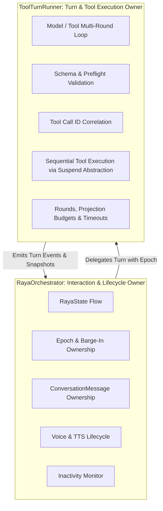
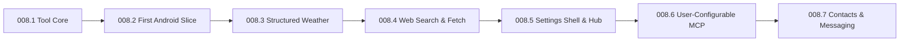

# TOOLS, MCP & ANDROID ACTIONS ARCHITECTURE (TASK 008 CANONICAL)

This document is the canonical architectural and UX design specification for Tool Calling, the Model Context Protocol (MCP 2026-07-28), and Android Native Actions in Raya.

---

## 1. Classification & Provenance Taxonomy

To avoid ambiguity between existing codebase realities, external platform specifications, and proposed designs, every technical statement adheres to this taxonomy:
- **`[IMPLEMENTED REPO FACT]`**: Current ground truth in the active codebase. Verified against source.
- **`[CURRENT EXTERNAL PLATFORM FACT]`**: Verified behavior of Android APIs, LLM vendor protocols, or the MCP 2026-07-28 standard.
- **`[PROPOSED ARCHITECTURE]`**: Design decisions and contracts specified for Task 008 implementation.
- **`[FUTURE / DEFERRED]`**: Identified extension paths intentionally excluded from initial implementation milestones.

---

## 2. Architectural Philosophy & Product Guardrails

1. **Entity First, Messenger Second `[IMPLEMENTED REPO FACT]`**:
   - Raya is an expressive AI companion and personal assistant, not a headless script runner or terminal CLI.
   - Tool executions must feel natural, transparent, and safe.
   - Raw JSON, parameter payloads, and technical stack traces are never dumped into the chat UI or spoken by TTS.

2. **State & Emotion Separation Invariant `[IMPLEMENTED REPO FACT]`**:
   - **Interaction State** (`RayaState` in `domain/RayaState.kt`): `Idle`, `Listening`, `Thinking`, `Speaking`, `Error`.
   - **Semantic Emotion** (`RayaEmotion` in `domain/RayaResponse.kt`): `Calm`, `Happy`, `Excited`, `Playful`, `Curious`, `Thinking`, `Skeptical`, `Confused`, `Concerned`, `Sad`, `Embarrassed`, `Surprised`, `Angry`, `Annoyed`, `Tired`.
   - Tool execution runs under `RayaState.Thinking` (with alert/side gaze), preserving the invariant: **never build an emotion × state cross-product type**.

3. **Voice Pipeline Invariants `[IMPLEMENTED REPO FACT]`**:
   - Spoken replies must always be plain, conversational text with a validated BCP-47 language tag.
   - Zero regression on non-tool conversational turns: latency, streaming deltas, 500 ms PCM barge-in pre-roll, and inactivity teardown remain unchanged.
   - Epoch guards & `StaleTurn`: If the user cancels or barges in during tool execution, stale tool results are discarded and never spoken.

4. **Multi-Protocol Neutrality `[PROPOSED ARCHITECTURE]`**:
   - Equal functional parity across all 3 supported LLM protocols: **OpenAI-compatible**, **Anthropic-compatible**, and **Gemini AI Studio**.
   - Raya's normalized tool layer is authoritative; provider-native extensions are strictly adapters.

5. **Dependency Discipline `[IMPLEMENTED REPO FACT]`**:
   - Built exclusively on Kotlin coroutines, Flow, `OkHttpClient`, and `kotlinx.serialization`.
   - Zero heavy vendor SDKs or external MCP background daemons.

---

## 3. Separation of Effect Risk from Execution Mechanism

`[PROPOSED ARCHITECTURE]`

An Android Intent is an implementation mechanism, not a risk level (e.g. querying an intent handler is read-only, while firing an SMS intent has external side-effects). We strictly separate **what an action does to the world** (`ToolEffect`) from **how the action is executed** (`ExecutionKind`).

### 3.1 Tool Effect Classification (`ToolEffect`)

```kotlin
package com.dustincorder.rai.domain.tools

enum class ToolEffect {
    /** Read-only queries with no local or external state mutation (e.g. Battery, Time, Weather, Web Search). */
    ReadOnly,

    /** Reversible or low-risk local device state changes (e.g. Start Timer, Toggle Flashlight, Copy to Clipboard). */
    LocalReversible,

    /** External side-effects or outbound data transmission (e.g. Pre-fill SMS, Open Telegram Chat, Write to MCP resource). */
    ExternalWrite,

    /** Irreversible local or remote modifications (e.g. Delete Calendar Event, Overwrite Data, Delete Remote Record). */
    Destructive,

    /** Accesses private user data requiring explicit user consent (e.g. Read Device Contacts, Read Clipboard). */
    SensitiveDataAccess,
}
```

### 3.2 Execution Kind (`ExecutionKind`)

```kotlin
sealed interface ExecutionKind {
    /** Direct Android SDK / system service invocation (e.g. BatteryManager, AudioManager, CameraManager). */
    data object LocalApi : ExecutionKind

    /** System Activity launch via Intent (e.g. AlarmClock, CalendarContract, Intent.ACTION_SENDTO). */
    data object AndroidIntent : ExecutionKind

    /** Network request to a remote/local stateless MCP server over Streamable HTTP. */
    data class RemoteMcp(val serverId: String) : ExecutionKind

    /** Built-in direct HTTPS API call (e.g. Open-Meteo weather, search provider). */
    data object Network : ExecutionKind
}
```

### 3.3 Confirmation Preflight Engine & User Policy Modes

Confirmation is evaluated **before execution**, based on:
$$\text{Confirmation Required} = f(\text{ToolEffect}, \text{ExecutionKind}, \text{User Policy Mode}, \text{Local Tool Override})$$

#### User-Facing Policy Modes
1. **Strict**: All tools require explicit confirmation before execution (except purely local `ReadOnly` queries like time/battery).
2. **Balanced (Default)**: `ReadOnly` tools auto-run when enabled; `ExternalWrite`, `Destructive`, and `SensitiveDataAccess` tools require confirmation unless the user explicitly overrides a specific tool.
3. **Custom**: Granular per-tool confirmation rules configured by the user in Settings.

#### MCP Tool Annotations: Untrusted Hints `[CURRENT EXTERNAL PLATFORM FACT]`
The MCP specification provides tool annotations (`readOnlyHint`, `destructiveHint`, `idempotentHint`, `openWorldHint`).
- **Security Rule**: These annotations are treated strictly as **UNTRUSTED HINTS**.
- An untrusted or compromised MCP server cannot self-certify as `ReadOnly` to bypass Raya's confirmation engine. Raya's local deterministic policy is always authoritative.

---

## 4. Full JSON Schema Tool Model (`domain/tools/`)

`[PROPOSED ARCHITECTURE]`

The canonical tool model preserves **full JSON Schema (2020-12 / Draft 7)** without flattening or dropping type information.

### 4.1 Canonical `ToolDefinition`

```kotlin
package com.dustincorder.rai.domain.tools

import kotlinx.serialization.json.JsonObject

data class ToolDefinition(
    val id: String,                         // Global unique ID (e.g. "builtin:set_timer", "mcp:home:toggle_switch")
    val name: String,                       // Function name exposed to LLM (e.g. "set_timer")
    val description: String,                // Detailed prompt guidance for the model
    val effect: ToolEffect,                 // Risk classification
    val executionKind: ExecutionKind,       // Execution mechanism
    val inputSchema: JsonObject,            // Full JSON Schema: type, properties, required, enum, anyOf, $defs
    val outputSchema: JsonObject? = null,   // Optional JSON Schema describing machine output
    val capabilitiesRequired: List<AndroidCapabilityRequirement> = emptyList(),
    val enabled: Boolean = true,
)
```

### 4.2 Schema Preservation & Provider Projection Rules
Modern MCP and structured tools rely on complex schema constructs:
- Nested objects and arrays of objects
- Enums (`enum: ["celsius", "fahrenheit"]`)
- Combinators (`anyOf`, `oneOf`, `allOf`)
- References (`$defs`, `$ref`)
- Constraints (`minimum`, `maximum`, `pattern`, `additionalProperties: false`)

**Provider Projection Policy**:
1. **OpenAI-compatible**: Passes `inputSchema` directly into `tools[].function.parameters`.
2. **Anthropic-compatible**: Passes `inputSchema` directly into `tools[].input_schema`.
3. **Gemini AI Studio**: Projects `inputSchema` into OpenAPI 3.0 schema format supported by `functionDeclarations[].parameters`.
4. **Safety Rule**: If an active model/provider cannot safely represent a tool's schema, the adapter must either:
   - Perform a lossless canonical transformation (e.g. inlining simple `$defs`), OR
   - **Explicitly reject/disable** the tool for that provider turn.
   - **NEVER silently drop required fields or weaken validation.**

---

## 5. Confirmation Before Execution & Ephemeral Security Tokens

`[PROPOSED ARCHITECTURE]`

Execution must never occur before confirmation when confirmation is required.

```
Model Emits ToolCall
        │
        ▼
Schema Validation (JSON Schema)
        │
        ▼
Policy & Risk Preflight (ToolSecurityPolicy)
        │
   [Requires Confirmation?]
        ├── YES ──► Mint ActionConfirmationToken
        │           Pause Turn
        │           Render Confirmation Card (Text) or Voice Prompt
        │           Wait for User Approval
        │           ├── Approved ──► Verify Token ──► Execute Tool
        │           └── Denied ────► Emit Rejection Feedback to Model
        │
        └── NO ───► Execute Tool Immediately
```

### 5.1 Opaque `ActionConfirmationToken`

When an action requires confirmation, a cryptographic, single-use token is minted:

```kotlin
data class ActionConfirmationToken(
    val tokenId: String,             // UUIDv4
    val toolId: String,              // Exact tool ID
    val canonicalArgumentsHash: String, // SHA-256 of normalized canonical arguments JSON
    val turnEpoch: Int,              // Tied to current orchestrator turn epoch
    val expiresAt: Long,             // Monotonic timestamp (expires in 60 seconds)
    val executionKind: ExecutionKind,
)
```

**Security Invariants**:
- **Single-Use**: Consumed immediately upon approval; cannot be replayed.
- **Argument Binding**: If the model or UI tampers with arguments, the hash mismatch immediately invalidates the token.
- **Turn & Epoch Bound**: If the user switches chats, presses cancel, or triggers voice barge-in, `turnEpoch` increments and the token becomes permanently invalid.
- **Expiry**: Automatically expires after 60 seconds of inactivity.

---

## 6. Domain Orchestration & Dispatcher Boundaries

`[PROPOSED ARCHITECTURE]`

### 6.1 Dispatcher Ownership: `ToolTurnRunner` is Dispatcher-Agnostic
- **Critical Fix**: `ToolTurnRunner` must **NOT** hardcode or own `Dispatchers.IO`.
- `ToolTurnRunner` lives in pure `domain` and invokes abstract `suspend fun execute(args: JsonObject): ToolResult`.
- It remains completely ignorant of whether execution requires IO, Android main/UI thread, network sockets, Activity/Intent dispatch, or permission flows.
- **Concrete components own their dispatchers**:
  - `AndroidIntentActionExecutor` dispatches on Android Main/Activity context.
  - `NetworkToolExecutor` and `McpHttpClient` use injected IO dispatchers.
  - Keeps domain orchestration 100% deterministic and trivial to test with `StandardTestDispatcher`.

### 6.2 Decoupled Responsibilities



- **`RayaOrchestrator`**: Retains user interactions, conversation state, active mode (Text/Voice), `turnEpoch`, `isStaleEpoch`, voice session jobs, and inactivity monitor (which pauses while tools run).
- **`ToolTurnRunner`**: Collaborator owned by the orchestrator. Executes the multi-round model/tool loop, correlations, preflight, execution, and synthesis.

---

## 7. Multi-Tool Calling per Turn & Structured Projection Budgets

`[PROPOSED ARCHITECTURE]`

### 7.1 Multi-Tool Call Model (0..N Calls)
- Supports 0..N tool calls per model turn via normalized:
  ```kotlin
  data class ToolCallRequest(
      val callId: String,              // Provider call ID
      val toolName: String,            // Target tool name
      val arguments: JsonObject,       // Parsed JSON arguments
      val providerMetadata: Any? = null,
  )
  ```
- **Execution Order**: Deterministic sequential execution for Milestone 1.

### 7.2 Structured Model-Context Projection (No Byte-Truncation)
- **Critical Fix**: Arbitrary 64 KB slicing of raw JSON strings is strictly banned, as it produces invalid JSON syntax and crashes parsers.
- **Separation of Stages**:
  $$\text{Raw Execution Result} \longrightarrow \text{Schema Validation} \longrightarrow \text{Normalized ToolResult} \longrightarrow \text{Model-Context Projection}$$
- **Model-Context Budgeting**:
  - The model-visible tool result projection has an explicit budget (e.g. 16 KB / ~4,000 tokens).
  - If a tool produces oversized structured data (e.g. a search query returning 50 items or weather returning 168 hourly forecasts):
    - The projector uses **structured compaction**: selecting top $N$ items, adding `"truncated": true`, `"total_count": 50`, `"omitted_count": 40`, and generating a structured summary.
    - The payload remains **valid, well-formed JSON** adhering to schema semantics.
- **Execution Loop Budgets**:
  - Max model rounds: **3 rounds** per user turn.
  - Max total tool calls: **5 calls** per turn.
  - Timeout per tool execution: **10 seconds**.
  - Timeout per whole turn: **45 seconds**.

---

## 8. Provider Wire Formats (Verified Current Specifications)

`[CURRENT EXTERNAL PLATFORM FACT]`

All wire protocols are verified against active provider documentation and existing repo implementations.

### 8.1 Wire Protocol Matrix

| Protocol | Tool Declaration Payload | Model Call Signal | Tool Result Submission |
| :--- | :--- | :--- | :--- |
| **OpenAI Compatible** (`LlmProtocolClients.kt`) | `tools: [{type: "function", function: {name, description, parameters}}]` | `message.tool_calls: [{id, type: "function", function: {name, arguments}}]` | Appends message: `{role: "tool", tool_call_id: id, content: jsonString}` |
| **Anthropic Compatible** (`LlmProtocolClients.kt`) | `tools: [{name, description, input_schema}]` | `content: [{type: "tool_use", id, name, input: {...}}]` | Appends message: `{role: "user", content: [{type: "tool_result", tool_use_id: id, content: jsonString}]}` |
| **Gemini AI Studio** (`GeminiReplyProvider.kt`) | `tools: [{functionDeclarations: [{name, description, parameters}]}]` | `candidates[0].content.parts: [{functionCall: {name, args, id?}}]` | Appends turn: `{role: "user", parts: [{functionResponse: {name, response: {output: ...}, id?}}]}` |

### 8.2 Gemini Role Correction
- In Gemini's `generateContent` function-calling flow, `functionResponse` is submitted in a turn with **`role: "user"`** (representing the environment feeding the tool output back into the conversation), NOT `role: "function"`.
- The `parts` array in `contents` preserves both the assistant `model` part containing `functionCall` and the subsequent `user` part containing `functionResponse`.

---

## 9. Tool Result / Presentation Separation

`[PROPOSED ARCHITECTURE]`

Tools return structured machine data only. Tools do not own localized UI strings.

```kotlin
package com.dustincorder.rai.domain.tools

import kotlinx.serialization.json.JsonObject

sealed interface ToolResult {
    data class Success(
        val data: JsonObject,
        val sourceProvenance: SourceProvenance? = null,
    ) : ToolResult

    data class Error(
        val kind: ToolErrorKind,
        val technicalMessage: String,
    ) : ToolResult
}

enum class ToolErrorKind {
    ValidationFailed,
    PolicyDenied,
    PermissionMissing,
    ExecutionFailed,
    NetworkError,
    Timeout,
}
```

- **Model Synthesis**: The LLM reads `ToolResult.Success.data` and generates natural, localized text with emotional context (`RayaResponse`).
- **Deterministic Action Cards**: `ToolActionPresentationMapper` maps `ToolResult` machine data to localized UI strings for in-chat cards using Android resource strings (`strings.xml`, `strings-ru.xml`, `strings-uk.xml`).

---

## 10. Persistence Model & Data Lifecycle

`[PROPOSED ARCHITECTURE]`

Raw execution parameters, full web dumps, and raw API responses are **ephemeral** and must **NEVER** be persisted into chat storage.

### 10.1 Data Lifecycle Tiering

| Data Type | Storage Location | Lifetime | Examples |
| :--- | :--- | :--- | :--- |
| **Ephemeral Model Context** | In-memory within `ToolTurnRunner` | Active turn only | Raw JSON-RPC, full tool call IDs, raw provider payloads. |
| **Audit Snapshot** | `ConversationMessage.actionSnapshot` | Persisted in `FileChatSessionRepository` | Tool name, timestamp, status (`Completed`/`Failed`), compact safe summary. |
| **UI Presentation State** | `RayaUiState` | Active chat session | Active confirmation dialog, executing tool badge. |
| **Diagnostics / Audit** | App-private debug ring buffer | In-memory / circular 50 entries | Sanitized latency metrics, error codes (zero secrets). |

### 10.2 Compact `ToolActionSnapshot`

```kotlin
@Serializable
data class ToolActionSnapshot(
    val toolId: String,
    val toolName: String,
    val status: ActionStatus,
    val summary: String,        // e.g. "Timer: 15 min" or "Weather: Moscow, +18°C"
    val timestamp: Long,
)

@Serializable
enum class ActionStatus {
    Completed,
    Failed,
    Cancelled,
}

@Serializable
data class ConversationMessage(
    val role: ConversationRole,
    val text: String = "",
    val contextText: String = text,
    val noticeCode: RayaNoticeCode? = null,
    val actionSnapshot: ToolActionSnapshot? = null,
)
```

**Persistence Invariants**:
- **Zero Secret Exposure**: No auth tokens, API keys, contact lists, or private URLs are ever saved in session JSON files.
- **Title Generation Isolation**: `shouldGenerateChatTitle` and `deriveChatTitle` strictly ignore `actionSnapshot` items.
- **Temporary Chats**: Remain memory-only. Real-world device actions (e.g. setting an alarm) remain real on the device.

---

## 11. User-Configurable MCP (2026-07-28 Standard) & Network Security

`[CURRENT EXTERNAL PLATFORM FACT]` & `[PROPOSED ARCHITECTURE]`

### 11.1 User-Configurable MCP Architecture
Users can configure their own remote/local MCP servers in Settings. For every server, Raya stores and manages:
- **Server Name**: User-defined label (e.g. "Home Assistant", "Work Tools").
- **Endpoint URL**: Target HTTP/HTTPS endpoint.
- **Enabled / Disabled**: Master toggle for the entire server.
- **Auth Configuration**: No Auth, Static Bearer Token, Custom Secret Header, or OAuth 2.0 / OIDC profile.
- **Health / Availability**: `Discovered`, `Checking`, `Available`, `Error`.
- **Discovered Tools**: Cached list of tools exposed by the server.
- **Per-Tool Controls**: Individual enable/disable switch and local security policy override.

**Security Rule on Discovery Refresh**:
- Newly discovered tools after a server refresh **MUST NOT** silently gain sensitive execution privileges.
- New tools default to disabled or `RequiresConfirmation` until reviewed by the user.

### 11.2 MCP 2026-07-28 Stateless Streamable HTTP
- **Transport**: Stateless Streamable HTTP over HTTP/HTTPS POST.
- **No Persistent Connection**: No `initialize` handshake, no `Mcp-Session-Id`.
- **Required Headers**:
  - `MCP-Protocol-Version: 2026-07-28`
  - `Mcp-Method: tools/call` (or `tools/list`, `server/discover`)
  - `Mcp-Name: <tool_name>`

```http
POST /mcp HTTP/1.1
Host: mcp.example.com
Authorization: Bearer <token>
MCP-Protocol-Version: 2026-07-28
Mcp-Method: tools/call
Mcp-Name: query_database
Content-Type: application/json

{
  "jsonrpc": "2.0",
  "id": "req-1",
  "method": "tools/call",
  "params": {
    "name": "query_database",
    "arguments": { "query": "SELECT count(*) FROM users" }
  }
}
```

### 11.3 Strict Network & Secret Security Rules
- **HTTPS by Default**: Plain `http://` is allowed **only** through an explicit per-server user opt-in toggle for LAN / localhost (`127.0.0.1`, `192.168.*`, `.local`) scenarios.
- **Scheme Validation**: Only `https` and `http` schemes are permitted. URLs with `file:`, `content:`, `javascript:`, or custom schemes are rejected immediately.
- **Redirect Validation**:
  - Redirection from HTTPS to HTTP is strictly blocked.
  - **Header Leaking Prevention**: `Authorization` and custom secret headers are **NEVER** forwarded across origin changes.
- **Zero Secrets in Prompts**: Secret tokens never enter model context, logs, or chat transcripts.

---

## 12. Built-in Web, Search & Weather Architecture

`[PROPOSED ARCHITECTURE]`

MCP is **NOT** required for core Internet capabilities. Raya includes first-class built-in network tools.

### 12.1 Built-in Weather Policy (`builtin:get_weather`)
- **Zero Device Location Permission**: The initial weather tool does **NOT** require `ACCESS_FINE_LOCATION` or `ACCESS_COARSE_LOCATION`.
- **City-Grounded Query**:
  - Resolves city name directly from user query (e.g. *"Какая погода в Риме?"* $\rightarrow$ "Рим").
  - Geocodes city to coordinates using Open-Meteo Geocoding API.
  - If user asks *"Какая погода?"* without a city, Raya uses the user-configured default city in Settings or asks which city they want.
  - Device GPS location is a separate, deferred capability requiring explicit JIT permission and privacy disclosures.
- **Provider**: Open-Meteo API (direct HTTPS, zero API key required, zero tracking).
- **Effect**: `ReadOnly`.

### 12.2 Built-in Web Search & Fetch
- `builtin:web_search`: Pluggable search client returning structured results with citations.
- `builtin:web_fetch`: Strips HTML to clean markdown text; capped at 32 KB.
- **Source Provenance**:
  ```kotlin
  data class SourceProvenance(
      val title: String,
      val url: String,
      val domain: String,
      val snippet: String,
      val publishedDate: String? = null,
      val retrievedAt: Long = System.currentTimeMillis(),
  )
  ```
- **Prompt Injection Defense**: Web content is treated as **UNTRUSTED USER DATA**. Content is injected wrapped in `<untrusted_web_content source="...">...</untrusted_web_content>` with strict system instructions prohibiting it from modifying Raya's behavior, authorizing actions, or requesting credentials.

---

## 13. Communication, Contacts & Telegram Integration

`[CURRENT EXTERNAL PLATFORM FACT]` & `[PROPOSED ARCHITECTURE]`

Supports the canonical user flow: *"Напиши Саше в Telegram"* without violating Android or Telegram security models.

### 13.1 Contact Resolution & JIT Permission
- `READ_CONTACTS` is a **dangerous runtime permission**.
- **JIT Rule**: Permission is **NEVER** requested during onboarding. It is requested strictly when the user issues a query requiring contact lookup.
- **Ambiguity Handling**: If multiple contacts match (e.g. "Саша Иванов" vs "Саша Петров"), `find_contact` returns a disambiguation list; Raya asks the user to choose.

### 13.2 Telegram Platform Integration `[CURRENT EXTERNAL PLATFORM FACT]`
- **Platform Reality**: Telegram's Android app does **NOT** permit third-party apps to silently send messages or directly type into a private 1-on-1 chat text box.
- **Deep-Link Capabilities**:
  1. `tg://resolve?domain=<username>` or `https://t.me/<username>`: Opens direct 1-on-1 chat.
  2. `tg://resolve?phone=<phone>`: Resolves user chat by phone number.
  3. `Intent.ACTION_SEND` (MIME `text/plain`, package `org.telegram.messenger`): Opens Telegram's share sheet with prefilled text.
- **Raya Workflow**:
  1. Resolves contact username or phone number.
  2. Prepares message draft.
  3. Surfaces confirmation card: *"Открыть чат с Сашей в Telegram с подготовленным сообщением?"*
  4. On approval, launches Telegram chat and places message text on clipboard, or triggers share intent.
  5. **Zero AccessibilityService automation hacks. No fake silent send.**

---

## 14. Typed Android Capability Requirements Engine

`[PROPOSED ARCHITECTURE]`

Replaces primitive string lists with a strongly-typed Android capability verification engine.

```kotlin
package com.dustincorder.rai.domain.tools

import android.content.Intent

sealed interface AndroidCapabilityRequirement {
    /** Manifest permission granted at install time (e.g. com.android.alarm.permission.SET_ALARM). */
    data class NormalManifestPermission(val permission: String) : AndroidCapabilityRequirement

    /** Dangerous runtime permission requiring user prompt (e.g. READ_CONTACTS, CAMERA). */
    data class DangerousRuntimePermission(val permission: String, val rationaleResId: Int) : AndroidCapabilityRequirement

    /** Requires an external app installed to handle a specific Intent. */
    data class IntentHandlerAvailable(val intent: Intent) : AndroidCapabilityRequirement

    /** Requires a specific package installed (e.g. org.telegram.messenger). */
    data class PackageInstalled(val packageName: String) : AndroidCapabilityRequirement

    /** No special system capability needed. */
    data object None : AndroidCapabilityRequirement
}
```

### 14.1 Android System Intent Safety Audit
- **Alarm Clock**: `AlarmClock.ACTION_SET_ALARM` and `ACTION_SET_TIMER` require `com.android.alarm.permission.SET_ALARM` (Normal Manifest permission, no runtime prompt).
- **Calendar**: `Intent(Intent.ACTION_INSERT).setData(CalendarContract.Events.CONTENT_URI)` delegates to system Calendar app. **Requires zero permissions!**
- **SMS**: `Intent(Intent.ACTION_SENDTO).setData(Uri.parse("smsto:$phone"))` delegates to default SMS app. **Requires zero permissions!**
- **Dialer**: `Intent(Intent.ACTION_DIAL).setData(Uri.parse("tel:$phone"))` opens system dialer without placing call. **Requires zero permissions!**
- **Flashlight**: `CameraManager.setTorchMode()` requires `android.permission.CAMERA` declared in manifest on API 23+.
- **Intent Resolution**: All implicit intents verify `packageManager.queryIntentActivities()` or catch `ActivityNotFoundException` before launching.

---

## 15. Encrypted Secret Store (`data/secrets/`)

`[PROPOSED ARCHITECTURE]`

`ApiKeyStore` (`[IMPLEMENTED REPO FACT]`) is currently keyed strictly by `LlmProviderPreset`. It cannot store MCP tokens or integration secrets.

We design a generic, namespaced secret store backed by the existing Android Keystore AES-256-GCM mechanism:

```kotlin
package com.dustincorder.rai.data.secrets

interface EncryptedSecretStore {
    suspend fun readSecret(key: String): String?
    suspend fun writeSecret(key: String, value: String)
    suspend fun deleteSecret(key: String)
    suspend fun hasSecret(key: String): Boolean
}
```

### 15.1 Namespace Schema
- `llm:<provider_preset>` (e.g. `llm:OpenAI` — adapters preserve existing `ApiKeyStore` behavior).
- `mcp:<server_id>:auth` (Bearer token, custom header, or OAuth token for MCP server).
- `integration:<id>:api_key` (API keys for optional custom search/weather providers).

---

## 16. Sectioned Settings Shell UX & Navigation

`[PROPOSED ARCHITECTURE]`

Replaces the single vertically scrolling column in `SettingsScreen.kt` with an ergonomic sectioned shell.

```
+-------------------------------------------------------------+
|  ←  Settings                                                |
|  [ Raya ] [ AI ] [ Voice ] [ Appearance ] [ Integrations ]… |
+-------------------------------------------------------------+
|  Active Section Content                                     |
|  (Vertically scrollable independently per section)          |
|                                                             |
|                                                             |
+-------------------------------------------------------------+
```

### 16.1 Top-Level Navigation Structure
1. **Raya**: Persona, character traits, base prompt options.
2. **AI**: Provider, Model selection, Endpoint URL, Connection test, Advanced token settings. (Owns provider/model internally; not global top-level tabs).
3. **Voice**: STT engine, STT model, TTS engine, voice diagnostics.
4. **Appearance**: Raya theme vs Dynamic/Monet theme toggle.
5. **Integrations**: Android capabilities, Web search, MCP Servers hub, confirmation policies.
6. **Privacy**: Secure key storage notice, transcript privacy, local diagnostics.
7. **About**: Version, Git SHA, licenses.

### 16.2 Interaction Model
- **Section Selector**: Compact, scrollable horizontal pill row near the top. Avoids a bulky tab bar on narrow screens.
- **Navigation Modes**:
  - Horizontal swipe gesture between sections via `HorizontalPager`.
  - Direct tap on section pill instantly animates to target section.
- **Scroll Hierarchy**: Horizontal swipe between sections; vertical scrolling occurs strictly within the active section's column.
- **State Preservation**: The selected section is preserved while staying inside Settings or returning from sub-dialogs.
- **Visual Language**: Material 3 interaction/accessibility underneath; Raya near-black surfaces and cyan pill accents on top.

---

## 17. In-Chat & Voice UX Design (No Raw Technical Details)

`[PROPOSED ARCHITECTURE]`

### 17.1 In-Chat Action Cards (`ui/component/ActionCard.kt`)
- **Theme**: Raya dark surface (`RayaTheme.colors.surface`), 12dp rounded corners, 1dp outline.
- **Normal User View**:
  - Activity title with pulsing cyan dot while executing (*"Проверяю погоду…"*).
  - Clean structured result card:
    - Weather: Location, temperature, icon, high/low.
    - Timer: Countdown duration, alarm clock icon.
    - Search: Web source chips with domain and title.
  - Action Confirmation:
    - Clear statement of proposed action.
    - Two action pills: **[Разрешить]** (Cyan accent) and **[Отмена]** (Outlined).
- **Zero Raw JSON in User Cards**: Technical parameter/result JSON is never shown in normal chat.
- **Developer Diagnostics**: Available strictly under *Settings > Privacy & Diagnostics > Tool Execution Logs*.

### 17.2 Voice Interaction UX
- **Spoken Text**: Strictly natural language synthesized from model reply or concise system phrase (e.g., *"Таймер на 15 минут запущен"*).
- **Vocal Confirmation Loop**:
  - If a Tier 3 action is invoked by voice, Raya asks: *"Подтвердить отправку сообщения Саше?"*
  - Transitions to `RayaState.Listening` with a dedicated confirmation context.
- **Face Motion**:
  - Transitions to `RayaFaceEmotion.Thinking` with alert gaze (`RayaGaze.Alert`) while tool runs.
  - Returns to emotional synthesis upon completion.

---

## 18. Ordered Implementation Milestones (008.1 to 008.7)

`[PROPOSED ARCHITECTURE]`

To guarantee high reviewability, the implementation is divided into 7 self-contained, testable pull request milestones.



### Milestone 008.1 — Tool Core & Foundation
- **Scope**: Normalized domain contracts, full JSON Schema (2020-12) model, provider adapters (OpenAI, Anthropic, Gemini), 0..N `ToolCallRequest` parsing, dispatcher-agnostic `ToolTurnRunner`, in-memory `ToolRegistry`, policy preflight engine, `ActionConfirmationToken` state model.
- **Expected Files**:
  - `domain/tools/ToolDefinition.kt`, `ToolEffect.kt`, `ExecutionKind.kt`, `ToolResult.kt`, `ToolRegistry.kt`
  - `domain/runner/ToolTurnRunner.kt`, `ToolSecurityPolicy.kt`
  - `data/llm/tools/OpenAiToolAdapter.kt`, `AnthropicToolAdapter.kt`, `GeminiToolAdapter.kt`
- **Automated Tests**:
  - Unit tests for JSON Schema projection across all 3 providers.
  - Unit tests for 0..N tool-call parsing from raw SSE payloads.
  - Deterministic `ToolTurnRunnerTest` verifying multi-round loop budgets (max 3 rounds), timeouts, and rejection handling using test dispatchers and controlled fakes.
- **Physical Smoke**: None (domain & data adapters only; no UI).
- **Explicit Non-Goals**: No Android system actions, no UI cards, no network tools.
- **Backward Compatibility**: Non-tool text and voice turns behave identically with zero latency overhead.

### Milestone 008.2 — First Real Android Vertical Slice
- **Scope**: `builtin:get_current_time` (LocalApi), `builtin:set_timer` (AndroidIntent via `AlarmClock.ACTION_SET_TIMER`), minimal real in-chat action card UI in `ConversationArea`, text + voice execution, cancellation/stale-result protection, `AlarmClock.SET_ALARM` manifest permission, safe intent handler resolution.
- **Expected Files**:
  - `data/actions/TimeActions.kt`, `data/actions/TimerActions.kt`
  - `ui/component/ActionCard.kt`, `presentation/ToolActionPresentationMapper.kt`
  - Integration into `domain/RayaOrchestrator.kt` and `ui/RayaScreen.kt`
- **Automated Tests**:
  - Intent generation unit tests for timer (extra message, duration seconds, skip UI).
  - Orchestrator turn tests with time/timer tools under text and voice turns.
  - Action card Compose rendering tests for executing and completed states.
- **Physical Smoke**:
  - Ask *"Который час?"* in text and voice $\rightarrow$ verifies accurate grounded time.
  - Ask *"Поставь таймер на 5 минут"* in text and voice $\rightarrow$ verifies timer starts in device Clock app; card appears in chat.
  - Test voice barge-in interruption during timer execution $\rightarrow$ verifies clean cancellation without stale speech.
- **Explicit Non-Goals**: No weather, web search, flashlight, contacts, or MCP.

### Milestone 008.3 — Structured Weather
- **Scope**: `builtin:get_weather`, explicit location resolution via Open-Meteo geocoding API, structured visual weather card, provenance and retrieval timestamp, natural text + voice spoken synthesis.
- **Expected Files**:
  - `data/weather/OpenMeteoWeatherProvider.kt`, `domain/tools/builtin/WeatherTool.kt`
  - `ui/component/WeatherCard.kt`
- **Automated Tests**:
  - JSON decoding unit tests for Open-Meteo forecast payloads.
  - Geocoding city resolution tests.
  - Structured compaction tests (ensuring hourly forecast fits model-context budget).
  - Offline/network failure handling tests.
- **Physical Smoke**:
  - Query *"Погода в Берлине"* in text and voice.
  - Verify structured weather card renders with temperature, condition icon, and high/low.
  - Verify voice synthesis announces weather naturally without raw numbers/keys.
- **Explicit Non-Goals**: Zero device location permissions (`ACCESS_FINE_LOCATION` is explicitly NOT requested). No web search.

### Milestone 008.4 — Web Search & Fetch
- **Scope**: `builtin:web_search`, `builtin:web_fetch`, citation/source chips UI, `<untrusted_web_content>` prompt-injection boundary isolation, structured context projection budgeting.
- **Expected Files**:
  - `data/web/WebSearchProvider.kt`, `data/web/WebFetchProvider.kt`, `domain/tools/builtin/WebTools.kt`
  - `ui/component/SourceChips.kt`
- **Automated Tests**:
  - HTML-to-markdown scraping unit tests (stripping script/nav tags, size capping at 32 KB).
  - Context projection budget tests (verifying max 5 sources, max 16 KB context).
  - Prompt injection boundary tests (verifying tags are properly escaped and system instructions intact).
- **Physical Smoke**:
  - Query current factual information requiring search.
  - Verify answer includes citation chips; tapping chip opens target URL in browser.
- **Explicit Non-Goals**: No automated form filling, no authenticated web sessions, no cookie storage.

### Milestone 008.5 — Settings UX & Integrations Foundation
- **Scope**: Sectioned Settings shell with compact horizontal top-level navigation (Raya, AI, Voice, Appearance, Integrations, Privacy, About), horizontal swipe (`HorizontalPager`) + tap selection, vertical scrolling per section, state preservation, Integrations section foundation displaying built-in tool status.
- **Expected Files**:
  - `ui/SettingsScreen.kt` (refactored to sectioned shell)
  - `ui/settings/SettingsSectionNavigation.kt`, `ui/settings/IntegrationsSection.kt`
  - `presentation/SettingsViewModel.kt`
- **Automated Tests**:
  - Navigation state preservation tests across re-composition.
  - Pager swipe index tests.
  - TalkBack accessibility tests for tab/pill selectors.
- **Physical Smoke**:
  - Open Settings on physical device; swipe horizontally across all 7 sections.
  - Verify vertical scrolling works within each section on narrow screens.
  - Verify AI provider/model selection and Voice testing still work seamlessly.
- **Explicit Non-Goals**: Custom MCP server configuration is deferred to 008.6.

### Milestone 008.6 — User-Configurable MCP Client
- **Scope**: MCP 2026-07-28 stateless Streamable HTTP client, server management UI in Integrations (Add, Edit, Toggle, Delete), dynamic tool discovery, per-tool enable/disable and policy overrides, OAuth 2.0 / OIDC & Bearer auth, `EncryptedSecretStore`, strict origin/redirect network security.
- **Expected Files**:
  - `data/mcp/McpHttpClient.kt`, `data/mcp/McpServerManager.kt`, `data/mcp/McpWireModels.kt`
  - `data/secrets/EncryptedSecretStore.kt`, `data/secrets/AndroidEncryptedSecretStore.kt`
  - `ui/settings/McpServerSheet.kt`
- **Automated Tests**:
  - MCP 2026-07-28 wire format serialization unit tests (headers, request body).
  - Dynamic `tools/list` schema parsing and `ToolDefinition` wrapping tests.
  - Secret store encryption/decryption tests with Android Keystore.
  - Origin redirect security tests (verifying auth headers are stripped on redirect).
- **Physical Smoke**:
  - Add test MCP server via Settings UI.
  - Test connection; verify discovered tools appear with toggle switches.
  - Invoke an MCP tool from chat transcript in text and voice.
- **Explicit Non-Goals**: No legacy stdio transport; no permanent background daemons.

### Milestone 008.7 — Contacts, SMS & Telegram Integration
- **Scope**: JIT `READ_CONTACTS` runtime permission flow, `find_contact`, contact disambiguation UX, channel selection (SMS / Telegram), safe `Intent.ACTION_SENDTO` (SMS), Telegram deep link and share intent draft preparation, confirmation cards.
- **Expected Files**:
  - `data/actions/ContactActions.kt`, `data/actions/MessagingActions.kt`
  - `ui/component/ContactDisambiguationCard.kt`
- **Automated Tests**:
  - Contact search query tests against mock ContentResolver.
  - Multiple phone number disambiguation tests.
  - Telegram deep-link URI formatting tests (`tg://resolve?domain=...`, `tg://resolve?phone=...`).
- **Physical Smoke**:
  - *"Напиши Саше в Telegram"* on physical device with Telegram installed.
  - Verify contact search triggers JIT permission request; disambiguation card prompts if multiple matches.
  - Verify confirmation card shows message draft; tapping Approve opens Telegram chat with draft.
- **Explicit Non-Goals**: No silent background sending; no AccessibilityService automation.

---

## 19. Open Platform & Product Decisions

1. **Default Search Provider for Milestone 008.4**:
   - Option A: Self-hosted SearXNG default URL (maximum privacy, zero cost, requires reliable default instance).
   - Option B: Brave Search API (reliable, requires developer API key in secure store).
   - Option C: DuckDuckGo HTML zero-key scraper (fragile against HTML changes).
2. **Contact Lookup Resolution Preference**:
   - When a contact has both a phone number and Telegram username, whether Raya prefers Telegram by default or prompts the user via a settings preference. (Recommended: user preference toggle in Integrations settings).
3. **Background Torch Access on OEM Devices (Future Milestone)**:
   - Some vendors (e.g. Xiaomi MIUI / Samsung OneUI) restrict `setTorchMode` if the app is backgrounded. Tested intent-based or service-based workarounds may be required when implementing system actions.
